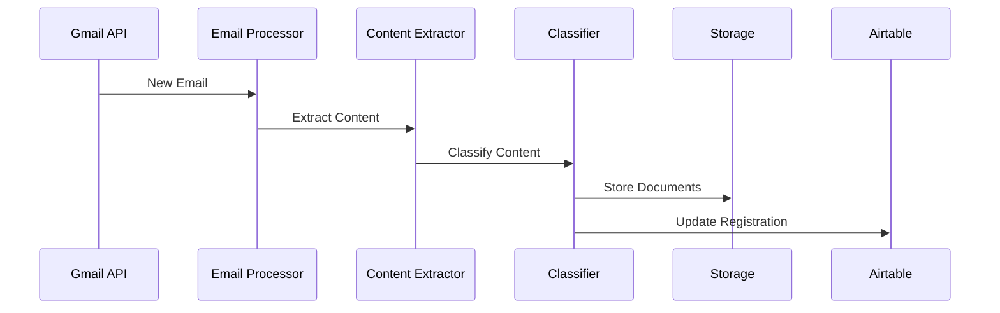
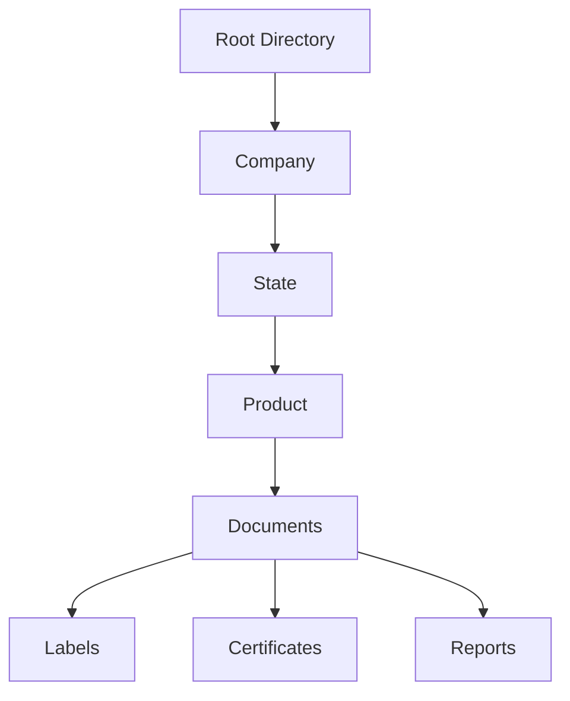

# Delta Gmail AI Autolabel - Core Architecture

## Business Context
Delta Analytical Corporation specializes in EPA and state-level pesticide registration services, handling complex regulatory documentation and multi-jurisdictional compliance. Our system processes critical communications including regulatory updates, client correspondence, product registrations, and financial documents.

## Problem Statement
We receive a high volume of incoming emails, many of which contain vital regulatory documents, client instructions, and financial information that require timely classification, storage, and follow-up. Manually processing these emails is laborious, prone to delays, and disruptive to our workflows. This increases both our time spent and risk of human error. Our goal is to build a robust, automated classification system to streamline routing, extraction, and storage, enabling our teams to focus on higher-value tasks.

## Message Flow Overview

## Core Services

### 1. Email Gateway
Acts as the primary entry point for all email/communication traffic. It will act as our reception and security desk:
- Authenticates incoming messages
- Scans for security threats (phishing, malware)
- Enforces rate limits
- Logs all message metadata
- Routes to appropriate processors

### 2. Classification Engine
Functions like a sophisticated mail-sorting facility, using:
- Rule-based classification for structured content
- AI-powered analysis for complex decisions
- Pattern matching for regulatory requirements
- Learning feedback loop for continuous improvement

Common Classifications:
- Registration Applications
- Regulatory Updates
- Client Correspondence
- Financial Documents
- Product Documentation

### 3. Document Processor
Operates like a document translation service, handling:
- PDF registration forms
- Excel spreadsheets
- Regulatory documentation
- Product specifications
- Supporting attachments

### 4. Storage Orchestrator
Functions like a smart filing system, organizing by:
- Client
- State/Jurisdiction
- Product Type
- Document Category
- Registration Status

### 5. Message Queue System
RabbitMQ serves as our central nervous system, coordinating all email processing activities. Like a post office, it accepts incoming email events and ensures reliable delivery to the appropriate processing services. This decoupling allows for:
- Scalable, fault-tolerant operations
- Improved system responsiveness
- Enhanced error handling

## Data Architecture

### 1. Document Organization

### 2. Data Models
- **Documents**: Core content containers with metadata
- **Classifications**: Content categorization and routing rules
- **Relationships**: Inter-document connections and dependencies
- **Audit Trail**: Complete history of all system actions

### 3. Search Index
Provides rapid access through multiple dimensions:
- Client identifiers
- State jurisdictions
- Product categories
- Document types
- Registration status

## Integration Layer

### 1. External Services
- **Gmail API**: Primary email source
- **Airtable**: Registration tracking
- **Google Cloud**: AI model hosting
- **Document Storage**: Secure file management

### 2. Internal Services
- **Authentication**: Identity management
- **Audit**: Activity tracking
- **Metrics**: System health monitoring
- **Cache**: Performance optimization

## Success Metrics

### 1. Performance Indicators
- Processing time per document
- Auto-classification accuracy
- Extraction success rate
- Manual intervention frequency

### 2. Business Impact
- Time saved per registration
- Error reduction percentage
- Processing capacity increase
- Cost per document processed

## Security Architecture

### 1. Perimeter Security
Like a secure facility’s checkpoints, controlling access through multiple authentication layers and monitoring for suspicious activities.

### 2. Data Protection
Implements encryption both in transit and at rest, similar to how valuable documents are protected during transport and storage.

### 3. Access Control
Manages permissions like a building’s access card system, ensuring our teams can access only the resources they need.

## Observability Stack

### 1. Monitoring
Acts as our system’s health dashboard, providing real-time visibility into service performance and processing status.

### 2. Logging
Maintains a detailed system journal, tracking all significant events for troubleshooting and audit purposes.

### 3. Metrics
Measures our system’s vital signs, tracking performance, accuracy, and resource utilization.