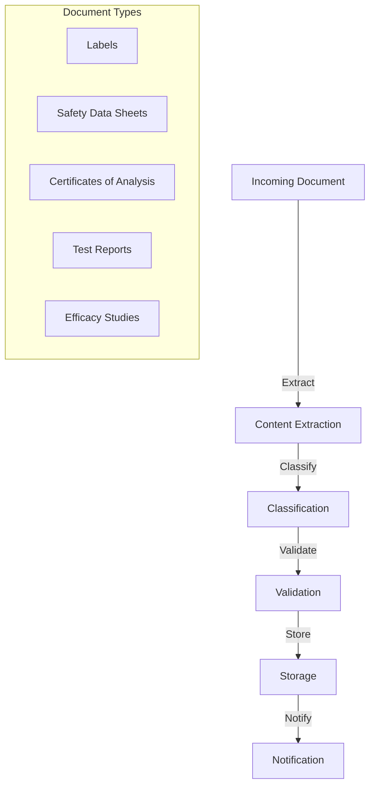
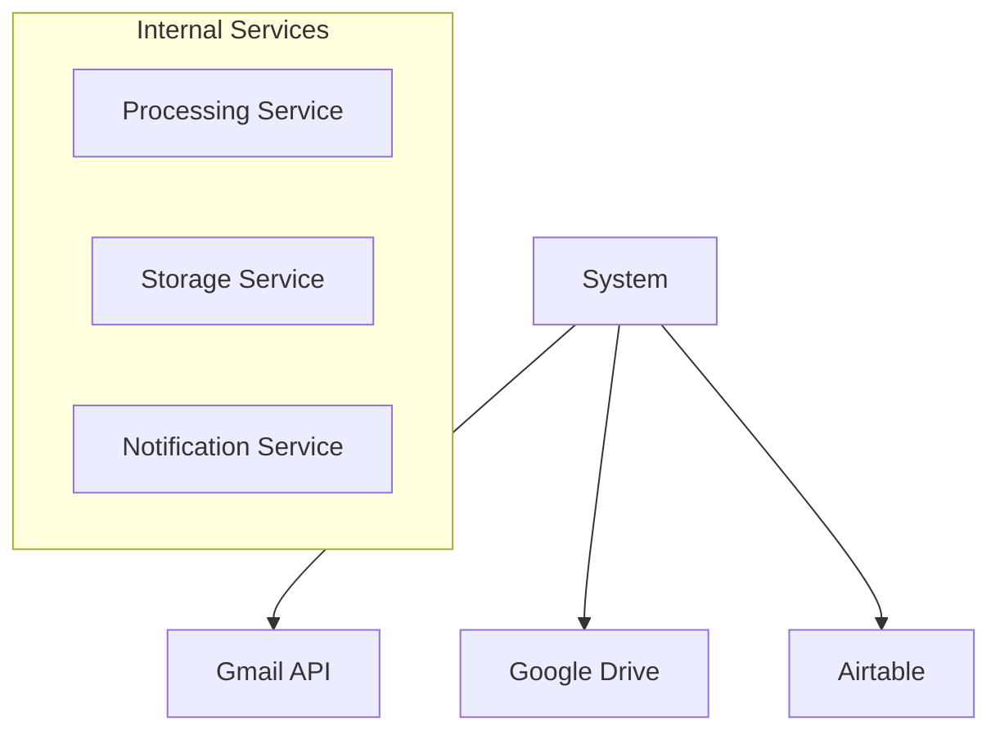
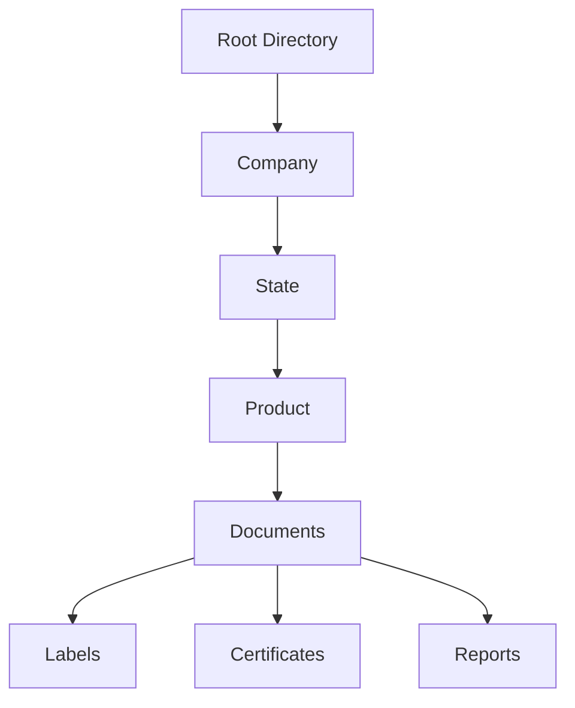

# System Overview: Automated Email Processing for Regulatory Compliance

## 1. Introduction

Delta Analytical Corporation specializes in providing EPA and state-level pesticide registration services.  A critical part of this work involves managing complex regulatory documentation and ensuring multi-jurisdictional compliance.  We handle a high volume of incoming emails daily, which contain vital regulatory documents, client correspondence, product registrations, and financial information.

Currently, manually processing these emails is a laborious and inefficient process. It is prone to delays, introduces risks of human error, and disrupts our team's workflows.  This manual approach increases both processing time and the potential for mistakes in critical regulatory tasks.

To address these challenges, we are developing a robust, automated email classification system.  This system aims to streamline the routing, extraction, and storage of email content, enabling our team to focus on higher-value tasks related to regulatory analysis and client service, rather than manual data entry and organization.

## 2. System Vision & Objectives

Our primary objectives for this automated email processing system are to:

*   **Streamline document classification and routing:** Automatically categorize and direct incoming emails and documents to the appropriate teams and workflows.
*   **Enhance accuracy in regulatory requirement tracking:** Improve the precision and reliability of identifying and managing critical regulatory information.
*   **Improve efficiency in cross-jurisdictional compliance verification:** Accelerate the process of ensuring compliance across different state and federal regulations.
*   **Maintain strict data privacy and security standards:**  Ensure the confidentiality and integrity of sensitive client and regulatory data throughout the processing lifecycle.

To achieve these objectives, the system is designed with the following principles in mind:

*   **Reliability:** Automatic retry mechanisms for failed operations, comprehensive logging for debugging, and alert systems for critical failures ensure robust and dependable operation.
*   **Human Oversight:**  A user-friendly dashboard allows for monitoring system performance and provides tools for manual review of automated decisions and feedback mechanisms to improve classification accuracy. Clear audit trails are maintained for all automated actions.

Our vision for the future of this system includes:

*   **Advanced Analytics:**  Pattern detection in email flows, predictive modeling for workload management, and insight generation for process improvement.
*   **Enhanced Automation:** Automated response generation, predictive classification improvements, and deeper integration with regulatory systems.
*   **Scaling Capabilities:** Support for multiple inboxes, enhanced processing speed, and broader attachment type support to accommodate future growth and increasing demands.

We will measure the success of this system through the following metrics:

*   **Processing success rates:**  The percentage of emails and documents processed without errors.
*   **Classification accuracy:** The correctness of automated document categorization.
*   **Response times:** The speed at which emails are processed and documents are classified and stored.
*   **Error rates:** The frequency of system errors and manual interventions required.
*   **Storage utilization:**  Efficiency in managing and storing processed documents.

## 3. System Architecture Overview

The system follows a clear document processing flow:



The system integrates with several key external services and internal components:



Key components of the system architecture include:

*   **Email Processor:**  Responsible for receiving and managing incoming emails from the Gmail API.
*   **Content Extractor:** Extracts relevant content and attachments from emails, preparing them for classification.
*   **Classifier:**  Utilizes machine learning and rule-based methods to categorize documents based on their content and metadata.
*   **Storage Orchestrator:**  Organizes and stores processed documents in Google Drive and potentially other storage systems, following a defined directory structure.
*   **Message Queue System (RabbitMQ):**  Acts as the central nervous system, ensuring reliable and asynchronous communication between different services.
*   **Search Index (Elasticsearch):** Provides rapid search capabilities across document content and metadata.
*   **Relationship Database (Graph Database):** Manages relationships between documents and other entities, enabling advanced navigation and analysis.

## 4. Data Architecture

Documents are organized within a hierarchical directory structure for efficient storage and retrieval:



The system manages several key data models:

*   **Documents:**  Represent the core content containers, including extracted text, attachments, and metadata.
*   **Classifications:** Store categorization information and routing rules applied to documents.
*   **Relationships:** Define connections and dependencies between documents and other entities, captured in a graph database.
*   **Audit Trail:** Maintains a complete history of all system actions for compliance and monitoring purposes.

## 5. Implementation Structure

The codebase is structured to separate concerns and improve maintainability:

```
src/
├── 📱 client/
│   ├── gmail.py
│   ├── message.py
│   ├── attachment.py
│   └── query.py
│
├── ⚙️ services/
│   ├── processor/
│   ├── extractor/
│   ├── classifier/
│   └── storage/
```

Key aspects of the implementation include:

*   **Modular Design:**  Services are designed to be modular and independent for easier scaling and maintenance.
*   **Cloud-Native Deployment:**  The system is designed for cloud deployment (AWS/GCP/Azure compatible) using Docker containers and environment-based configuration.
*   **Secure Design:** Secure credential management, rate limiting, and robust validation are implemented throughout the system.
*   **Comprehensive Testing:**  A comprehensive test suite ensures the quality and reliability of the system.

## 6. Future Roadmap

We plan to enhance the system with the following features in future iterations:

*   **Advanced ML Integration:**  Employ more sophisticated machine learning models for improved classification accuracy and feature extraction.
*   **Document Relationship Graphs:**  Leverage graph database capabilities to visualize and analyze relationships between documents for deeper insights.
*   **Automated Workflows:**  Implement automated workflows triggered by document classifications to streamline downstream processes.
*   **Enhanced Search Capabilities:**  Introduce natural language search, context-aware ranking, and search result explanations for improved information retrieval.
*   **Real-time Processing Optimization:**  Optimize processing pipelines for real-time or near real-time email processing.
*   **AI-Powered Features:**  Explore predictive navigation suggestions, automatic workflow detection, and smart document grouping to enhance user experience.
*   **Advanced UI Features:**  Develop custom navigation path templates, saved search paths, and context-aware visualizations for the user interface.
*   **Integration Points:**  Expand integration to external regulatory databases, client portals, and reporting systems for a more comprehensive ecosystem.

## 7. Conclusion

This automated email processing system is designed to significantly improve the efficiency and accuracy of document handling at Delta Analytical Corporation. By automating key tasks like classification, extraction, and routing, we aim to reduce manual workload, minimize errors, and empower our team to focus on higher-value regulatory analysis and client service.  This system will provide a scalable and robust foundation for managing regulatory information and ensuring compliance in the years to come.
