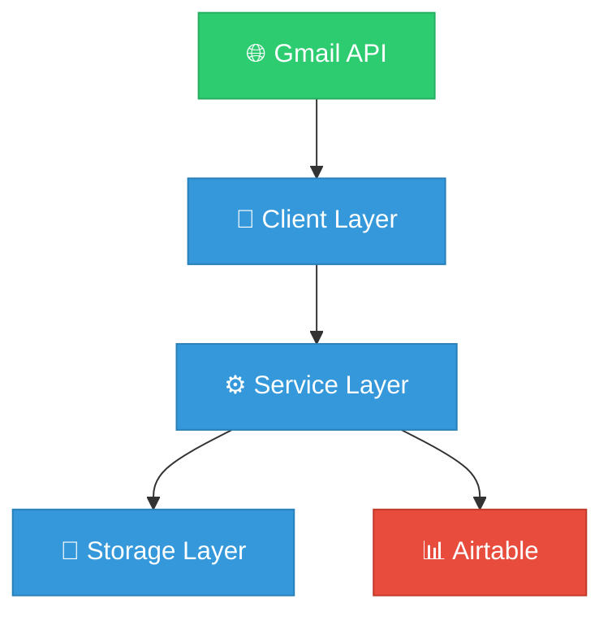
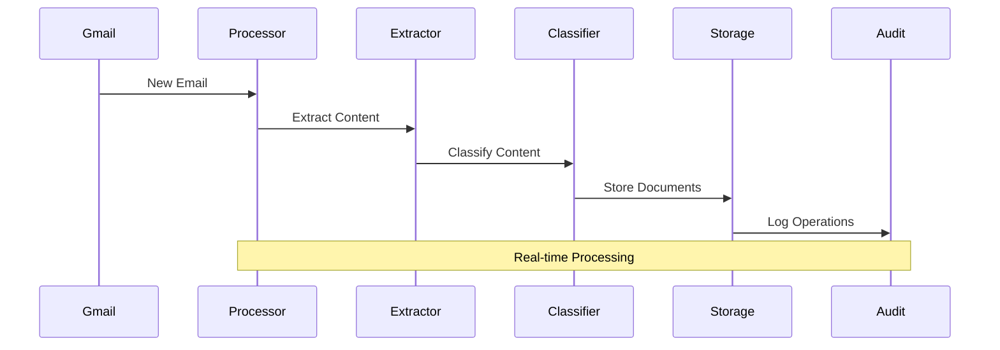

# 🏗️ System Architecture & Integration
> An elegant overview of our distributed document processing system

## 🎯 Core System Overview

<div align="center">



</div>

## 🔄 Core Services

### 1. Email Processing Pipeline

<div align="center">



</div>

### 2. Document Processing Flow

<div align="center">


</div>

## 📊 Service Components

| Service | Purpose | Key Features |
|---------|---------|--------------|
| 📧 Email Processing | Orchestration | • Queue Management<br>• Error Recovery<br>• Service Coordination |
| 📄 Content Extraction | Document Analysis | • PDF Processing<br>• Text Extraction<br>• Metadata Analysis |
| 🏷️ Classification | Content Organization | • ML Integration<br>• Pattern Matching<br>• Rule Engine |
| 💾 Storage | Data Management | • Version Control<br>• Search Indexing<br>• Access Control |

## 📈 Success Metrics

<div align="center">

| Metric | Target | Tracking |
|--------|--------|----------|
| Processing Success | >99% | 📊 |
| Classification Accuracy | >95% | 🎯 |
| Response Time | <2s | ⚡ |
| Error Rate | <0.1% | 📉 |
| Storage Optimization | >90% | 💾 |

</div>

## 🛠️ Implementation Structure

```
src/
├── 📱 client/
│   ├── gmail.py      # API Integration
│   ├── message.py    # Message Handling
│   ├── attachment.py # Content Processing
│   └── query.py      # Search Engine
│
├── ⚙️ services/
│   ├── processor/    # Email Processing
│   ├── extractor/    # Content Extraction
│   ├── classifier/   # ML Classification
│   └── storage/      # Data Management
```

## 🚀 Future Roadmap

1. 🤖 Advanced ML Integration
2. 🔗 Document Relationship Graphs
3. 🔄 Automated Workflows
4. 🔍 Enhanced Search Capabilities
5. ⚡ Real-time Processing

---
<div align="center">

[📚 Implementation Details](../specifications/implementation_details.md) | 
[📊 Data Flow Specs](../specifications/data_flows.md)

</div>