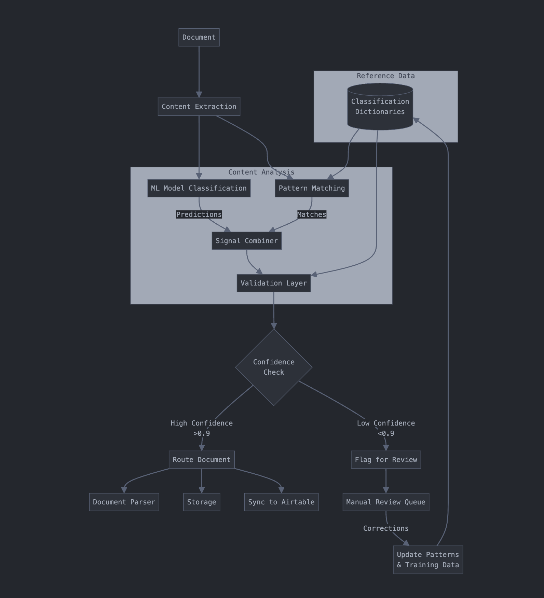

# classification steps Jan 29, 2025



# complete first-pass classification pipeline 

focusing on how a document moves from ingestion to routing.


## steps

1. **Content Extraction**
```python
def extract_content(document):
    """Extract text and metadata from document."""
    content = {
        'text': extract_text(document),
        'metadata': extract_metadata(document),
        'form_fields': extract_form_fields(document)
    }
    return content
```

2. **Parallel Processing**
```python
async def first_pass_classification(document):
    """Run ML and pattern matching in parallel."""
    content = extract_content(document)
    
    # Run both processes concurrently
    ml_results, pattern_results = await asyncio.gather(
        ml_model.predict(content),
        pattern_matcher.match(content)
    )
    
    return combine_signals(ml_results, pattern_results)
```

3. **Signal Combination & Validation**
```python
def combine_signals(ml_results, pattern_results):
    """Combine and validate classification signals."""
    classification = {
        'year': validate_year(ml_results, pattern_results),
        'state': validate_state(ml_results, pattern_results),
        'client': validate_client(ml_results, pattern_results),
        'type': validate_doc_type(ml_results, pattern_results),
        'metadata': combine_metadata(ml_results, pattern_results)
    }
    
    confidence = calculate_confidence(classification)
    return classification, confidence
```

4. **Routing Decision**
```python
def route_document(classification, confidence):
    """Route document based on classification and confidence."""
    if confidence >= 0.9:
        # High confidence - process automatically
        parser = get_parser(classification['type'])
        storage = get_storage_path(classification)
        sync_to_airtable(classification)
        
        return {
            'status': 'processed',
            'routes': {
                'parser': parser,
                'storage': storage,
                'airtable': True
            }
        }
    else:
        # Low confidence - send for review
        return {
            'status': 'review',
            'queue': 'manual_review',
            'confidence_issues': get_confidence_issues(classification)
        }
```

5. **Example Classification Output**
```python
{
    'classification': {
        'year': 2025,
        'term': 'Q1',
        'state': 'ME',
        'client': 'EEA',
        'base_type': 'RENEW',
        'description': 'initial-submission'
    },
    'confidence': {
        'overall': 0.95,
        'components': {
            'state': 0.99,  # High confidence from domain match
            'client': 0.98,  # High confidence from exact name match
            'type': 0.92,   # Good confidence from form type
            'year': 0.99    # High confidence from explicit date
        }
    },
    'routing': {
        'parser': 'maine_renewal_parser',
        'storage': 'gs://regulatory-docs/renewals/2025/ME/',
        'airtable_sync': True,
        'review_required': False
    }
}
```

Key Aspects:
1. Content extraction creates a normalized representation
2. ML and pattern matching run in parallel for efficiency
3. Results are combined and validated against known patterns
4. High confidence results route automatically
5. Low confidence results go for human review
6. All decisions feed back into improving the system


```flowchart TD
    Doc[Document] --> Extract[Content Extraction]
    Extract --> ML[ML Model Classification]
    Extract --> Pattern[Pattern Matching]
    
    subgraph Content Analysis
        ML --> |Predictions| Combine[Signal Combiner]
        Pattern --> |Matches| Combine
        Combine --> Validate[Validation Layer]
    end
    
    subgraph Reference Data
        Dict[(Classification\nDictionaries)] --> Pattern
        Dict --> Validate
    end
    
    Validate --> Conf{Confidence\nCheck}
    Conf -->|High Confidence\n>0.9| Route[Route Document]
    Conf -->|Low Confidence\n<0.9| Review[Flag for Review]
    
    Route --> Parser[Document Parser]
    Route --> Storage[Storage]
    Route --> Sync[Sync to Airtable]
    
    Review --> Manual[Manual Review Queue]
    Manual --> |Corrections| Update[Update Patterns\n& Training Data]
    Update --> Dict
```
