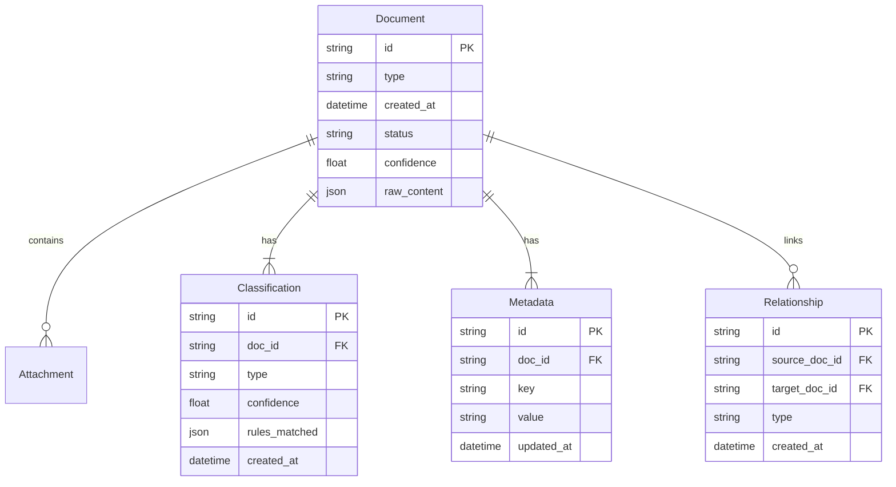

# Data Schemas & Relationships

## Core Data Models



## State Machine Definition

```yaml
Document:
  states:
    - received
    - processing
    - classified
    - validated
    - stored
    - complete
    - error
  
  transitions:
    received:
      - to: processing
        triggers: start_processing
        guards:
          - valid_content
          - authorized_sender
    
    processing:
      - to: classified
        triggers: classification_complete
        guards:
          - content_extracted
      - to: error
        triggers: processing_failed
    
    classified:
      - to: validated
        triggers: validation_passed
        guards:
          - confidence_threshold_met
      - to: error
        triggers: validation_failed
```

## Database Schema

### Core Tables

```sql
CREATE TABLE documents (
    id UUID PRIMARY KEY,
    type VARCHAR(50) NOT NULL,
    created_at TIMESTAMP NOT NULL,
    status VARCHAR(20) NOT NULL,
    confidence FLOAT,
    raw_content JSONB,
    metadata JSONB
);

CREATE TABLE classifications (
    id UUID PRIMARY KEY,
    document_id UUID REFERENCES documents(id),
    type VARCHAR(50) NOT NULL,
    confidence FLOAT NOT NULL,
    rules_matched JSONB,
    created_at TIMESTAMP NOT NULL
);

CREATE TABLE relationships (
    id UUID PRIMARY KEY,
    source_doc_id UUID REFERENCES documents(id),
    target_doc_id UUID REFERENCES documents(id),
    type VARCHAR(50) NOT NULL,
    created_at TIMESTAMP NOT NULL
);
```

## Data Validation Rules

### Document Validation
```yaml
type: object
required:
  - id
  - type
  - created_at
  - status
properties:
  id:
    type: string
    format: uuid
  type:
    type: string
    enum: [email, attachment, thread]
  status:
    type: string
    enum: [received, processing, classified, validated, stored, complete, error]
  confidence:
    type: number
    minimum: 0
    maximum: 1
```

## Data Flow Patterns

1. **Write Path**
   - Document creation
   - Classification updates
   - State transitions
   - Audit logging

2. **Read Path**
   - Document retrieval
   - Classification lookup
   - Relationship traversal
   - Status checking

3. **Update Path**
   - State changes
   - Classification refinement
   - Metadata enrichment
   - Relationship management 