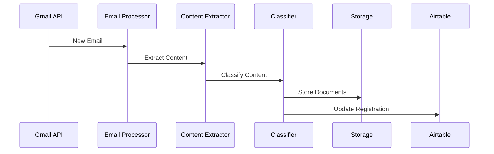
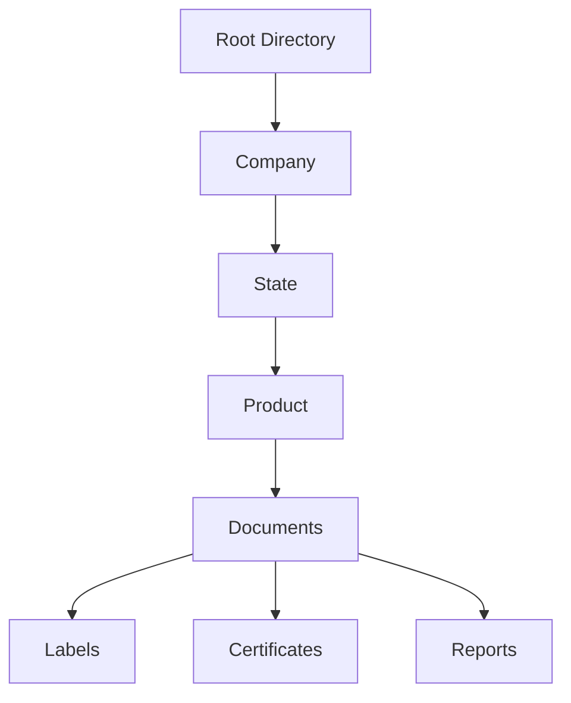
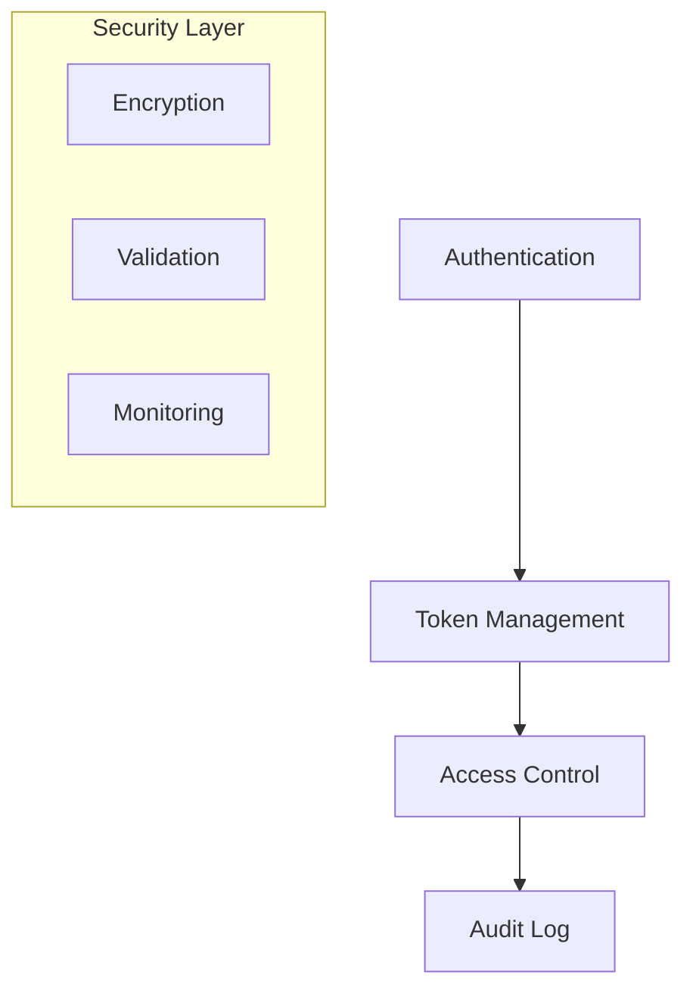
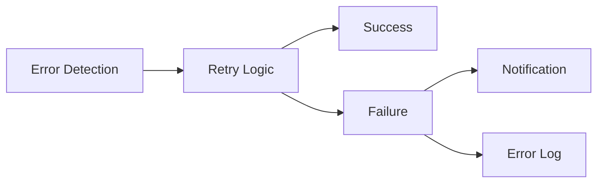
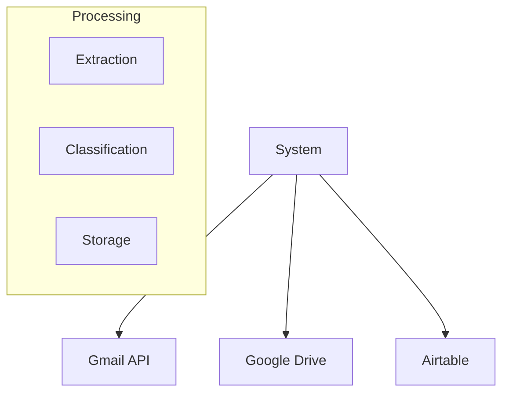

## Email Processing Flow

```mermaid
sequenceDiagram
    participant Gmail as Gmail API
    participant EP as Email Processor
    participant CE as Content Extractor
    participant CL as Classifier
    participant ST as Storage
    participant AT as Airtable

    Gmail->>EP: New Email
    EP->>CE: Extract Content
    CE->>CL: Classify Content
    CL->>ST: Store Documents
    CL->>AT: Update Registration
```

## Document Organization

```mermaid
graph TD
    Root[Root Directory] --> Company[Company]
    Company --> State[State]
    State --> Product[Product]
    Product --> Docs[Documents]
    
    Docs --> Labels[Labels]
    Docs --> Certificates[Certificates]
    Docs --> Reports[Reports]
```

## Security Flow

```mermaid
graph TB
    Auth[Authentication] --> Token[Token Management]
    Token --> Access[Access Control]
    Access --> Audit[Audit Log]
    
    subgraph Security Layer
        Encrypt[Encryption]
        Validate[Validation]
        Monitor[Monitoring]
    end
```

## Error Handling

```mermaid
graph LR
    Error[Error Detection] --> Retry[Retry Logic]
    Retry --> Success[Success]
    Retry --> Failure[Failure]
    Failure --> Notify[Notification]
    Failure --> Log[Error Log]
```

## Integration Points

```mermaid
graph TB
    System --> Gmail[Gmail API]
    System --> Drive[Google Drive]
    System --> Air[Airtable]
    
    subgraph Processing
        Extract[Extraction]
        Class[Classification]
        Store[Storage]
    end
```

[Back to System Overview](../architecture/system_overview.md) 