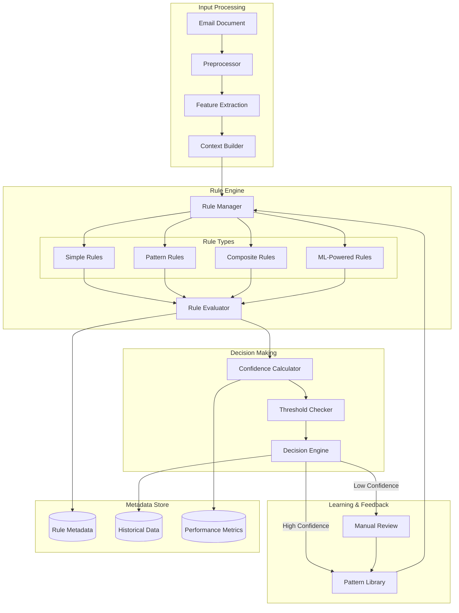
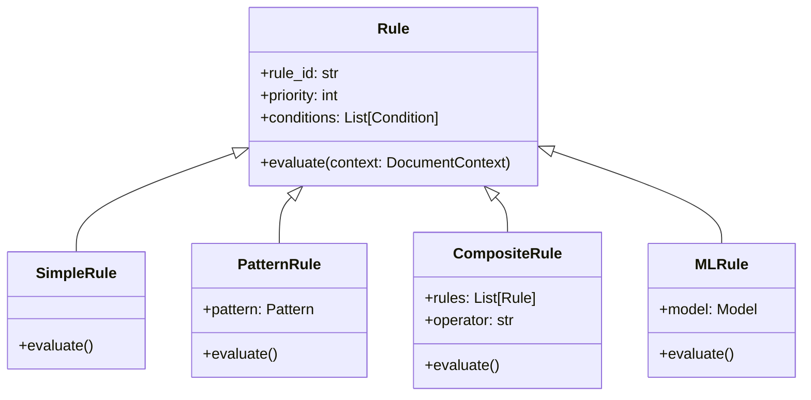
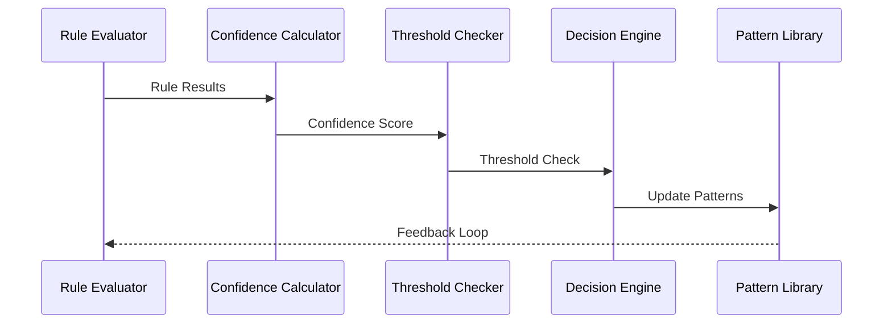

# Classification System Architecture

## System Overview



## Core Components

### 1. Rule Engine

```python
class Rule:
    def __init__(self, rule_id: str, priority: int, conditions: List[Condition]):
        self.rule_id = rule_id
        self.priority = priority
        self.conditions = conditions

    async def evaluate(self, context: DocumentContext) -> RuleResult:
        pass

class RuleManager:
    def __init__(self):
        self.simple_rules: Dict[str, Rule] = {}
        self.pattern_rules: Dict[str, PatternRule] = {}
        self.composite_rules: Dict[str, CompositeRule] = {}
        self.ml_rules: Dict[str, MLRule] = {}

    async def apply_rules(self, document: Document) -> ClassificationResult:
        pass
```

### 2. Rule Types



### 3. Context Building

```python
@dataclass
class DocumentContext:
    content: str
    metadata: Dict[str, Any]
    extracted_features: Dict[str, Any]
    historical_context: Optional[Dict[str, Any]] = None

class ContextBuilder:
    async def build_context(self, email: Email) -> DocumentContext:
        content = await self.extract_content(email)
        metadata = await self.extract_metadata(email)
        features = await self.extract_features(content, metadata)
        history = await self.get_historical_context(email)
        return DocumentContext(content, metadata, features, history)
```

### 4. Decision Making



### 5. Confidence Scoring

```python
class ConfidenceCalculator:
    def calculate_confidence(
        self, 
        rule_results: List[RuleResult],
        context: DocumentContext
    ) -> float:
        base_confidence = self.calculate_base_confidence(rule_results)
        context_modifier = self.calculate_context_modifier(context)
        return base_confidence * context_modifier

class ThresholdChecker:
    def check_thresholds(
        self, 
        confidence: float,
        classification: str
    ) -> ThresholdResult:
        return ThresholdResult(
            meets_threshold=confidence > self.get_threshold(classification),
            requires_review=self.needs_review(confidence, classification)
        )
```

## Performance Optimization

### Rule Prioritization
- Dynamic priority adjustment based on historical accuracy
- Rule chain validation for composite rules
- Context-aware rule selection

### Pattern Learning
- Automated pattern library updates
- Feedback-driven refinement
- Context-sensitive pattern matching

### Confidence Tuning
- Multi-factor scoring system
- Historical performance weighting
- Adaptive thresholds based on document type
``` 