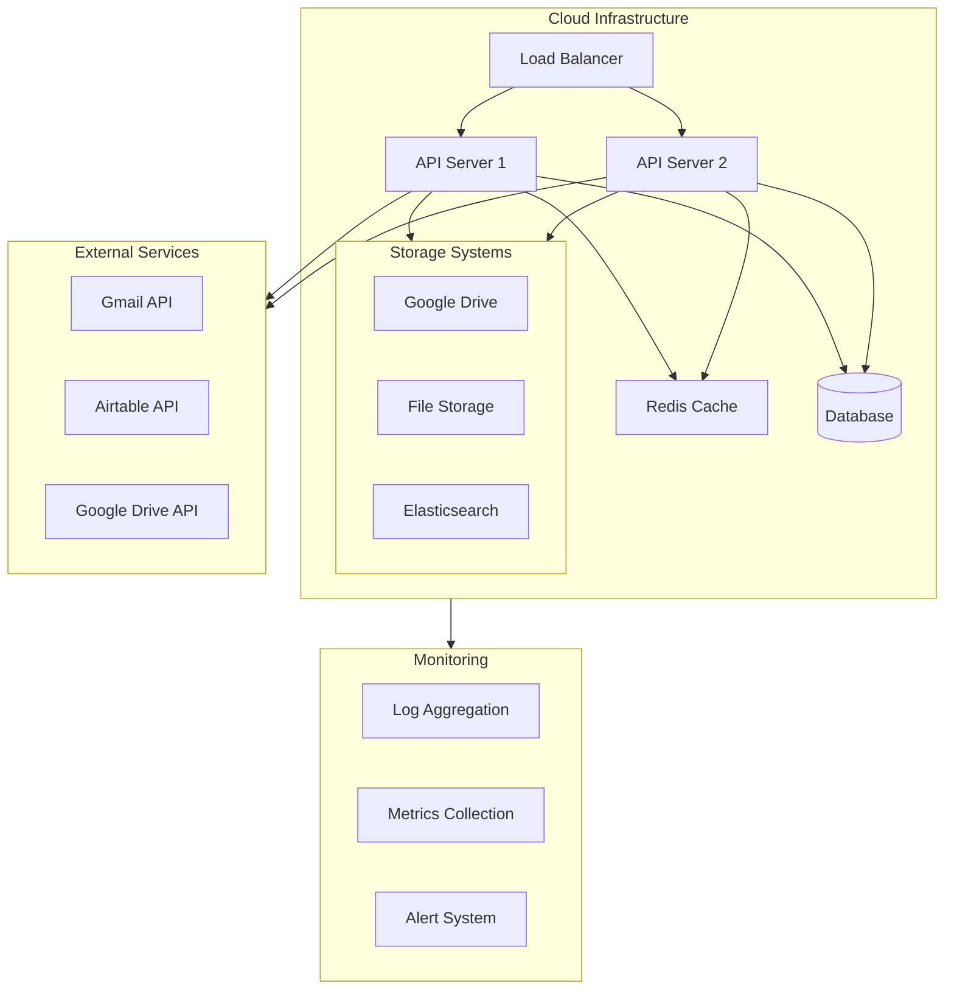

# Infrastructure & Deployment

## System Architecture



## Configuration Management

```yaml
# Example configuration structure
app:
  environment: production
  debug: false
  
services:
  gmail:
    batch_size: 100
    polling_interval: 300
    
  classification:
    confidence_threshold: 0.85
    learning_enabled: true
    
  storage:
    retention_period: 90
    backup_enabled: true
```

## Scaling Considerations

### Horizontal Scaling
- API servers scale based on load
- Background workers for heavy processing
- Distributed caching layer

### Performance Optimization
- Multi-level caching strategy
- Batch processing for email operations
- Asynchronous classification pipeline

### Reliability
- Circuit breakers for external services
- Exponential backoff retry mechanisms
- Fallback classification strategies

## Deployment Pipeline

1. **Build Stage**
   - Code compilation
   - Unit tests
   - Security scans

2. **Test Stage**
   - Integration tests
   - Performance tests
   - Security validation

3. **Deploy Stage**
   - Blue-green deployment
   - Configuration management
   - Health checks

## Monitoring & Alerting

- Real-time metrics collection
- Error rate monitoring
- Performance tracking
- Resource utilization alerts 