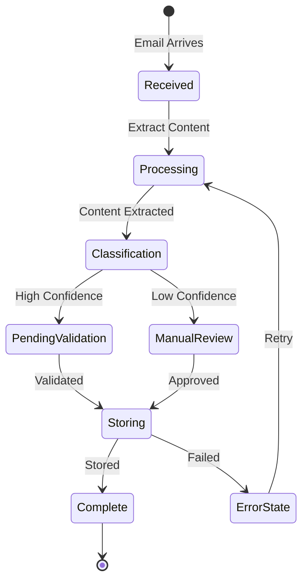
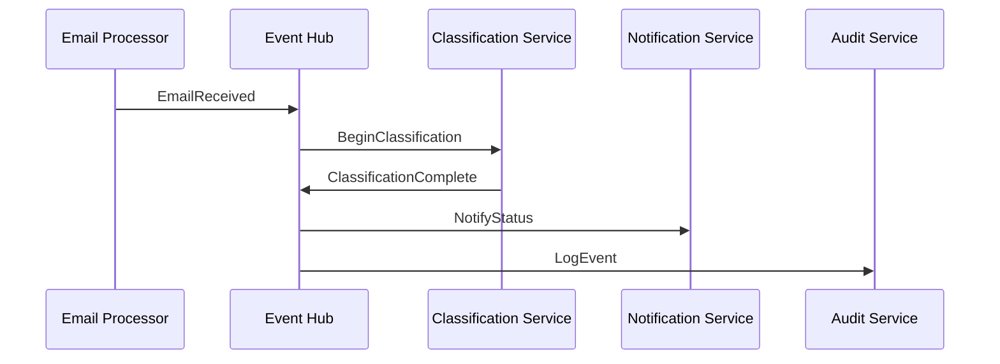

# State Management & Event Flow

## Document State Machine



## Event Flow



## State Definitions

### Email States
1. **Received**
   - Initial state when email is detected
   - Metadata extraction begins

2. **Processing**
   - Content parsing
   - Attachment handling
   - Feature extraction

3. **Classification**
   - AI model analysis
   - Rule application
   - Confidence scoring

4. **PendingValidation/ManualReview**
   - Automated checks
   - Human review queue
   - Approval workflow

5. **Storing**
   - Label application
   - Database updates
   - External system sync

6. **Complete**
   - Final state
   - Audit trail complete
   - Notifications sent

## Event Handlers

### Core Events
```yaml
EmailReceived:
  handlers:
    - ContentExtractor
    - MetadataProcessor
    - AuditLogger

ClassificationComplete:
  handlers:
    - LabelApplier
    - NotificationService
    - StateManager

ValidationRequired:
  handlers:
    - ReviewQueueManager
    - AlertService
    - TimeoutMonitor
```

## Error Handling

### Retry Policies
- Immediate retry for transient failures
- Exponential backoff for service issues
- Dead letter queue for unrecoverable errors

### Recovery Procedures
1. Automated recovery for known issues
2. Manual intervention triggers
3. State reconciliation process 