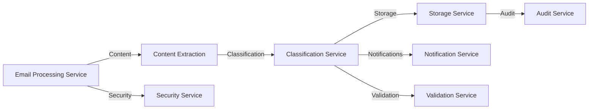
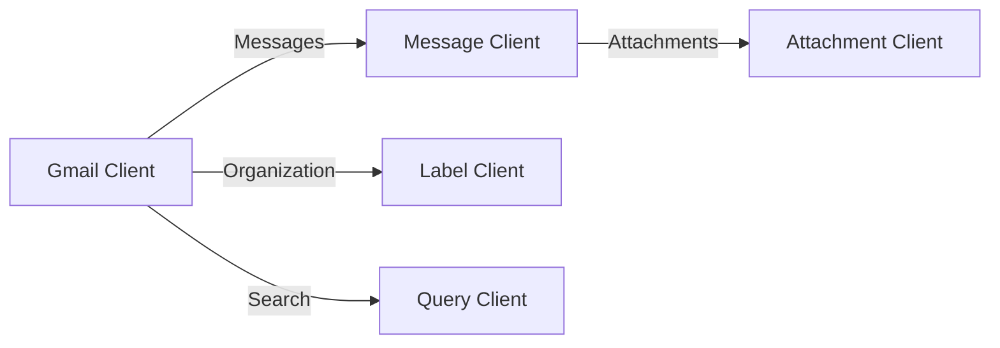
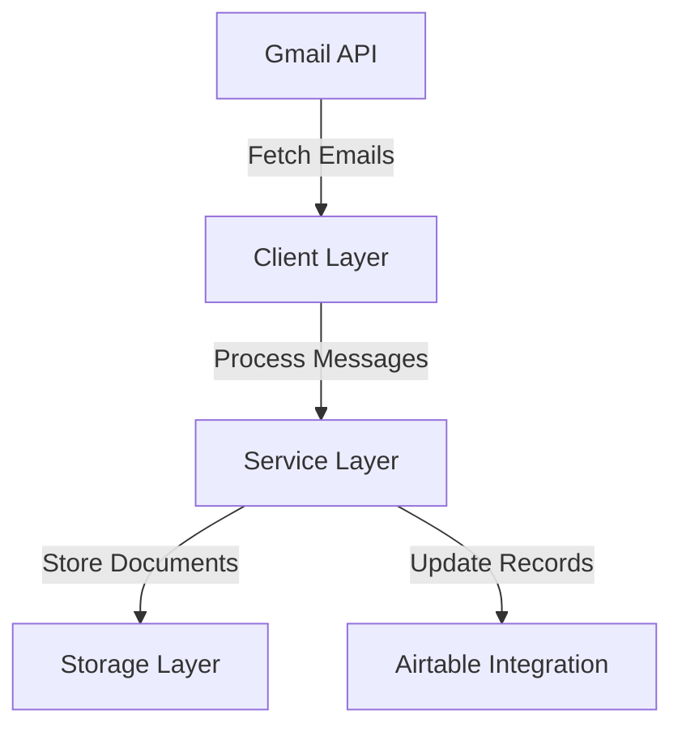
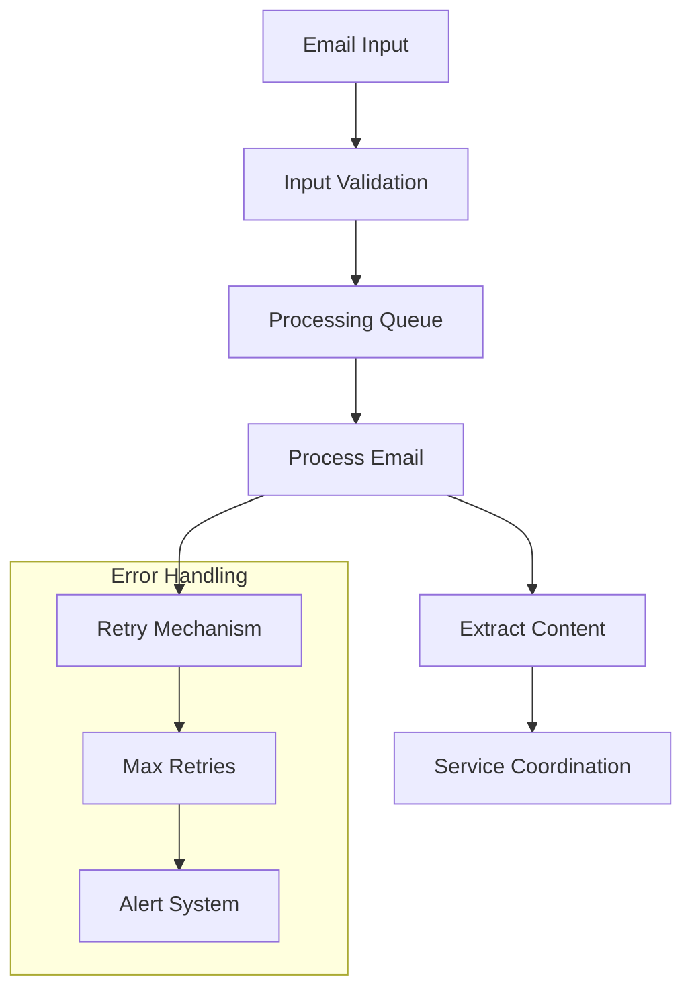
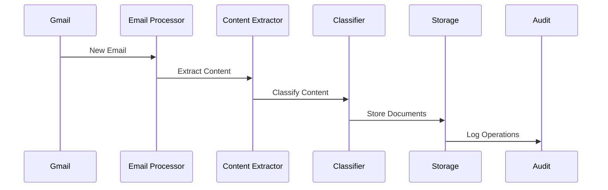
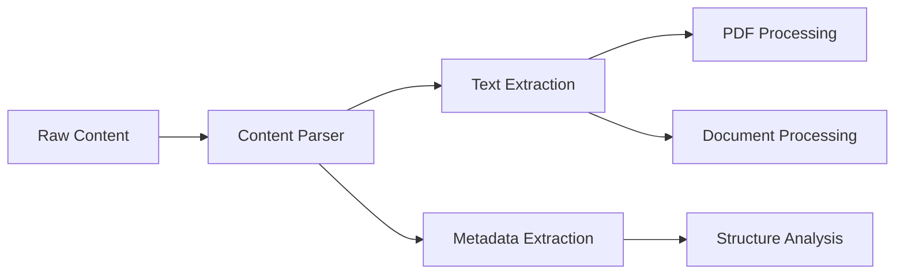
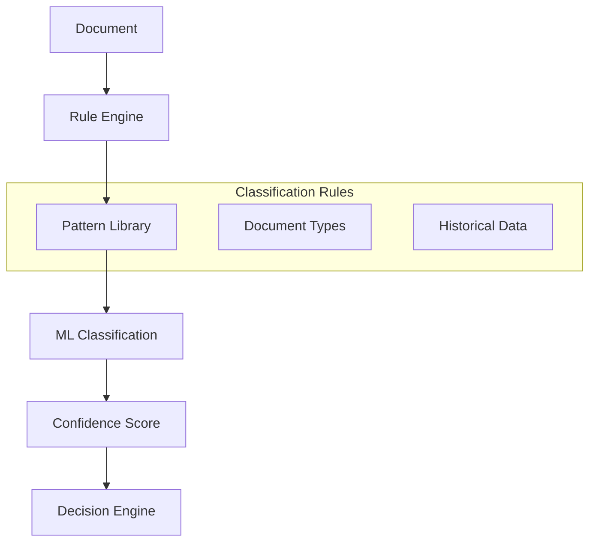
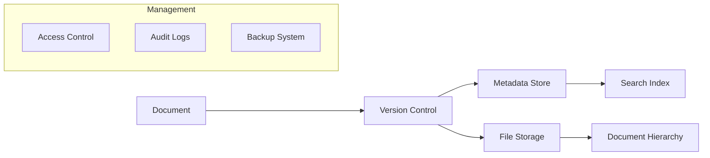
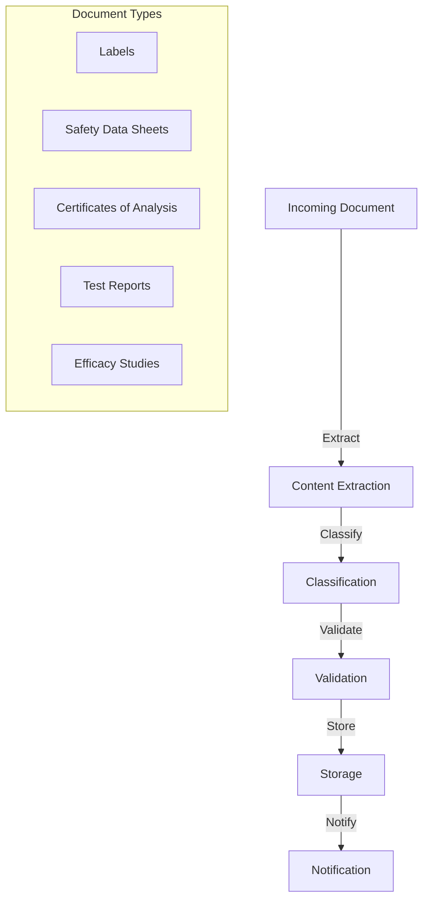
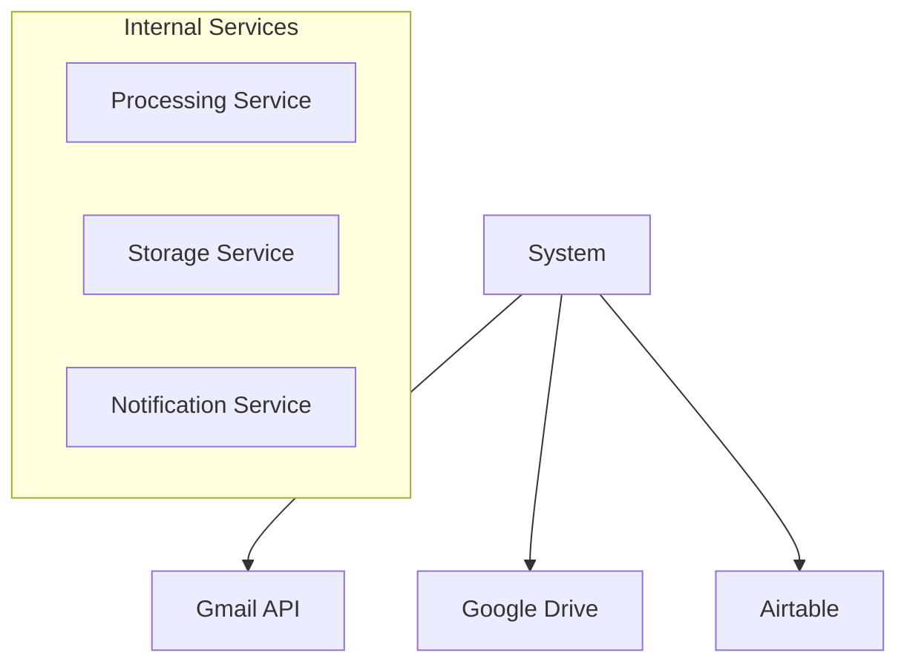

# System Architecture and Component Integration

## System Overview

### Core Architecture

#### Service Layer


#### Client Layer


#### System Integration


## Core Services

### 1. Email Processing Service


- Orchestrates the email processing pipeline
- Coordinates between different services
- Handles error recovery and retries
- Manages processing queues
  
#### Email Processing Pipeline


### 2. Content Extraction Service


- Parses email content and attachments
- Extracts text from PDFs and documents
- Identifies document structure and metadata
- Handles multiple document formats

### 3. Classification Service


- Determines document types
- Applies classification rules
- Maintains classification patterns
- Machine learning integration

### 4. Storage Service


- Manages document hierarchy
- Handles file organization
- Maintains document relationships
- Version control and metadata


## Implementation Details

### Client Layer (`src/client/`)
The client layer manages external service interactions:

```python
src/client/
├── gmail.py         # Gmail API interaction
├── message.py       # Email message handling
├── attachment.py    # Attachment processing
├── label.py        # Gmail label management
└── query.py        # Search functionality
```

## Document Processing Flow


## Integration Points


## Success Metrics
Tracked through Audit Service:
1. Processing success rates
2. Classification accuracy
3. Response times
4. Error rates
5. Storage utilization

## Future Roadmap
1. Machine learning enhancements
2. Document relationship tracking
3. Automated workflow triggers
4. Advanced search capabilities
5. Real-time processing optimization

[View Implementation Details](../specifications/implementation_details.md)
[View Data Flow Specifications](../specifications/data_flows.md) 