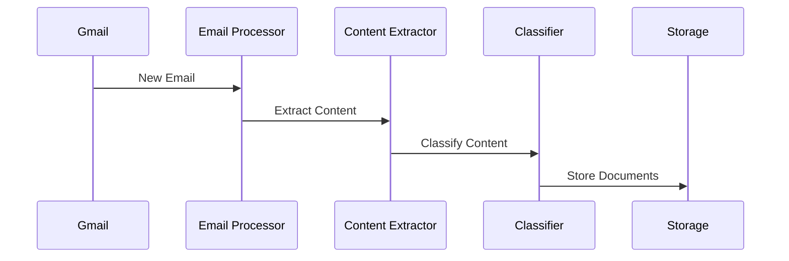
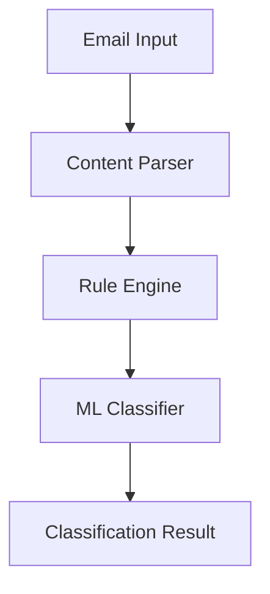
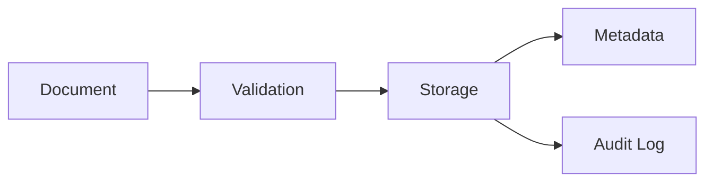
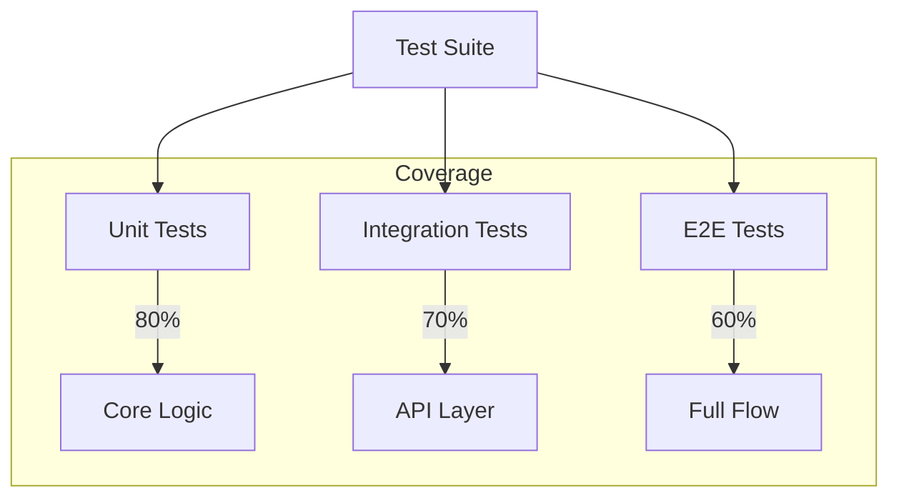

# Implementation Details

## Core Services

### 1. Email Processing Service


Key Components:
- Message extraction
- Content parsing
- Error handling
- Retry mechanisms

### 2. Classification Service


Features:
- Pattern matching
- ML-based classification
- Rule engine
- Confidence scoring

### 3. Storage Service


Capabilities:
- Document versioning
- Metadata management
- Access control
- Audit logging

## Testing Strategy


## Configuration Management
```python
config/
├── main.py           # Core configuration
├── logging.py        # Logging setup
└── security.py       # Security config
```

[Back to System Overview](../architecture/system_overview.md) 